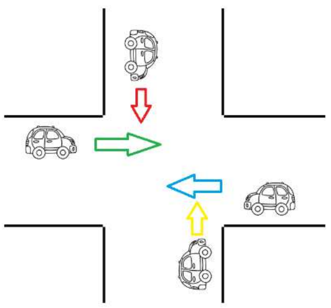

```bash
$$$$$$$$\        $$\                               $$$$$$$$\ $$\
$$  _____|       $$ |                              \____$$  |$$ |
$$ |   $$$$$$\ $$$$$$\    $$$$$$\   $$$$$$$\           $$  / $$ |
$$$$$\ \____$$\\_$$  _|  $$  __$$\ $$  _____|         $$  /  $$ |
$$  __|$$$$$$$ | $$ |    $$$$$$$$ |$$ /              $$  /   $$ |
$$ |  $$  __$$ | $$ |$$\ $$   ____|$$ |             $$  /    $$ |
$$ |  \$$$$$$$ | \$$$$  |\$$$$$$$\ \$$$$$$$\       $$$$$$$$\ $$$$$$$$\
\__|   \_______|  \____/  \_______| \_______|      \________|\________|
```

Os scripts podem ser executados diretamente no navegador [clicando aqui](https://pyground.anderzone.com.br/)

# Exercícios em Python - ISO030 Sistemas Operacionais

## Lote 1.1

### Primeira Entrega

1. Coletar o valor do lado de um quadrado, calcular sua área e apresentar o resultado.
2. Receba o salário de um funcionário e mostre o novo salário com reajuste de 15%.
3. Receba a base e a altura de um triângulo. Calcule e mostre a sua área.
4. Receba a temperatura em graus Celsius. Calcule e mostre a sua temperatura convertida em fahrenheit F = (9\*C+160) /5.
5. Receba os coeficientes A, B e C de uma equação do 2º grau (AX²+BX+C=0). Calcule e mostre as raízes reais (considerar que a equação possue2 raízes).
6. Receba os valores em x e y. Efetua a troca de seus valores e mostre seus conteúdos.
7. Receba os valores do comprimento, largura e altura de um paralelepípedo. Calcule e mostre seu volume.
8. Receba o valor de um depósito em poupança. Calcule e mostre o valor após 1 mês de aplicação sabendo que rende 1,3% a. m.
9. Receba os 2 números inteiros. Calcule e mostre a soma dos quadrados.
10. Receba 2 números reais. Calcule e mostre a diferença desses valores.
11. Receba o raio de uma circunferência. Calcule e mostre o comprimento da circunferência.
12. Receba o ano de nascimento e o ano atual. Calcule e mostre a sua idade e quantos anos terá daqui a 17 anos.
13. Receba a quantidade de alimento em quilos. Calcule e mostre quantos dias durará esse alimento sabendo que a pessoa consome 50g ao dia.
14. Receba 2 ângulos de um triângulo. Calcule e mostre o valor do 3º ângulo.
15. Receba os valores de 2 catetos de um triângulo retângulo. Calcule e mostre a hipotenusa.
16. Receba a quantidade de horas trabalhadas, o valor por hora, o percentual de desconto e o número de dependentes. Calcule o salário que serão as horas trabalhadas x o valor por hora. Calcule o salário líquido (= Salário Bruto – desconto). A cada dependente será acrescido R$ 100 no Salário Líquido. Exiba o salário a receber.
17. Calcule a quantidade de litros gastos em uma viagem, sabendo que o automóvel faz 12 km/l. Receber o tempo de percurso e a velocidade média.

---

### Segunda Entrega

18. Receba 2 valores inteiros. Calcule e mostre o resultado da diferença do maior pelo menor valor.
19. Receba 2 valores reais. Calcule e mostre o maior deles.
20. Receba 3 coeficientes A, B e C de uma equação do 2º grau da fórmula AX²+BX+C=0. Verifique e mostre a existência de raízes reais e se caso exista, calcule e mostre.
21. Receba 4 notas bimestrais de um aluno. Calcule e mostre a média aritmética. Mostre a mensagem de acordo com a média:

    a. Se a média for >= 6,0 exibir “APROVADO”;

    b. Se a média for >= 3,0 E < 6,0 exibir “EXAME”;

    c. Se a média for < 3,0 exibir “RETIDO”.

22. Receba 2 valores inteiros e diferentes. Mostre seus valores em ordem crescente.
23. Receba 3 valores obrigatoriamente em ordem crescente e um 4º valor não necessariamente em ordem. Mostre os 4 números em ordem crescente.
24. Receba um valor inteiro. Verifique e mostre se é divisível por 2 e 3.
25. Receba a hora de início e de final de um jogo (HH,MM), calcular o tempo do jogo em horas e minutos, sabendo que o tempo máximo é menor que 24 horas e pode começar num dia e terminar noutro.
26. Receba 2 números inteiros. Verifique e mostre se o maior número é múltiplo do menor.
27. Receba o número de voltas, a extensão do circuito (em metros) e o tempo de duração (minutos). Calcule e mostre a velocidade média em km/h.
28. Receba o preço atual e a média mensal de um produto. Calcule e mostre o novo preço sabendo que:

    | Venda Mensal    | Preço Atual  | Preço Novo |
    | :-------------- | :----------- | :--------- |
    | < 500           | < 30         | + 10%      |
    | >= 500 e < 1000 | >= 30 e < 80 | + 15%      |
    | >= 1000         | >= 80        | - 5%       |

    Obs.: para outras condições, preço novo será igual ao preço atual.

29. Receba o tipo de investimento (1 = poupança e 2 = renda fixa) e o valor do investimento. Calcule e mostre o valor corrigido em 30 dias sabendo que a poupança = 3% e a renda fixa = 5%. Demais tipos não serão considerados.
30. ...
31. Calcule e mostre o quadrado dos números entre 10 e 150.
32. Receba um número inteiro. Calcule e mostre o seu fatorial.
33. Receba um número. Calcule e mostre a série 1 + 1/2 + 1/3 + ... + 1/N.
34. Receba um número. Calcule e mostre os resultados da tabuada desse número.
35. Receba 2 números inteiros, verifique qual o maior entre eles. Calcule e mostre o resultado da somatória dos números ímpares entre esses valores.
36. Receba um número N. Calcule e mostre a série 1 + 1/1! + 1/2! + ... + 1/N!
37. Receba um número inteiro. Calcule e mostre a série de Fibonacci até o seu N’nésimo termo.
38. Receba 100 números inteiros reais. Verifique e mostre o maior e o menor valor. Obs.: somente valores positivos.
39. Calcule a quantidade de grãos contidos em um tabuleiro de xadrez onde:

    Casa: 1 2 3 4 ... 64

    Qdte: 1 2 4 8 ... N

40. Receba 2 números inteiros. Verifique e mostre todos os números primos existentes entre eles.
41. Mostre todas as possibilidades de 2 dados de forma que a soma tenha como resultado 7.
42. Calcule e mostre a série 1 + 2/3 + 3/5 + ... + 50/99
43. Calcule e mostre quantos anos serão necessários para que Ana seja maior que Maria sabendo que Ana tem 1,10 m e cresce 3 cm ao ano e Maria tem 1,5 m e cresce 2 cm ao ano.
44. Receba o número da base e do expoente. Calcule e mostre o valor da potência.
45. Calcule e mostre a série 1 – 2/4 + 3/9 – 4/16 + 5/25 - ... + 15/225

---

### Terceira Entrega

1. Refazer os exercícios do 18 ao 26 com procedimentos (Sem retorno) em Python SEM PASSAGEM DE PARÃMETROS (Com variáveis globais). Os exercícios devem ser organizados com chamada de main para a parte principal do código e a modularização.
2. Refazer os exercícios do 27 ao 29 com procedimentos em Python COM PASSAGEM DE PARÃMETROS (Com variáveis locais). Os exercícios devem ser organizados com chamada de main para a parte principal do código e a modularização.

---

### Quarta Entrega

1. Baseado no Ex. 34, fazer:
   a. Criar no Linux a pasta /tmp/exercicios
   i. Assegurar que ela tem permissão 744 (Fazer em Python)

   b. Declarar como globais, as variáveis:
   i. valor: int = 0
   ii. dir: str = ‘’
   iii. arq: str = ‘’
   iv. arq: str = ‘’

   c. Um procedimento main() que use valor como global e inicie uma variável contador
   e uma variável result, locais, peça ao usuário um valor entre 1 e 10 e chame 10 vezes
   a função mult(vlr, tab), passando o valor e o contador como parâmetros. O retorno
   da função deve ser retornado para a variável result. Por fim, ainda dentro da
   estrutura de repetição, deve-se chamar o procedimento grava(c, rslt), passando o
   contador e o result como parâmetros;

   d. A função mult deve receber o valor passado pelo usuário e o contador, deve
   declarar uma variável local res, que recebe a multiplicação de vlr e tab e é a variável
   de retorno da função;

   e. O procedimento grava recebe como parâmetros o contador da estrutura de
   repetição e o resultado da multiplicação. Utilizando dir e arq como globais, que
   devem ter dir = ‘/tmp/exercicios’ e arq = ‘ex34.txt’, deve declarar file, tipo, enc e linha
   como str vazios. A variável linha deve receber o cast da variável rslt (str(rslt))
   concatenado com uma quebra de linha (‘\n’). Criar, baseado no material de aula,
   deve-se verificar se o diretório existe e é diretório e, em sendo verdadeiro, verificar
   se o arquivo existe (Para definir se o tipo da operação será w (write) ou a (append)),
   mas só pode mudar o tipo para ‘a’, se c for maior que 0. Gravar a linha no arquivo.

2. Baseado no Ex. 21, fazer:
   a. Criar no Linux a pasta /tmp/exercicios
   i. Assegurar que ela tem permissão 744 (Fazer em Python)

   b. Declarar como globais, as variáveis:
   i. nome: str = ‘’
   ii. nota1, nota2, nota3, nota4, valor_media  float
   iii. dir: str = ‘’
   iv. arq: str = ‘’

   c. Um procedimento main() que inicie uma variável contador, local e chame 5 vezes o
   procedimento entrada;

   d. O procedimento entrada, usando os globais nome, nota1, nota2, nota3, nota4 e
   valor_media, pede a entrada do nome, das notas, chama uma função med(n1, n2,
   n3, n4) que calcula e retorna o valor da média aritmética, exiba em console a média
   e, por fim, chame o procedimento cadastro(nm, nt1, nt2, nt3, nt4, vlr_med);

   e. A função med, recebe como parâmetros, as 4 notas, inicializa uma variável local
   media (float), que recebe o cálculo da média aritmética das notas e será o retorno
   da função;

   f. O procedimento cadastro, recebe o nome do aluno, as 4 notas e a média como
   parâmetros, declara linha, como str e usa arq e dir como globais que devem ter dir
   = ‘/tmp/exercicios’ e arq = ‘ex21.txt’ . A variável linha deve receber uma operação de
   concatenar de nome, todas as notas e a média, sempre separados por ‘;’ e com
   quebra de linha ‘\n’ ao final. As variáveis numéricas, para serem concatenadas,
   devem passar por uma operação de cast (str(n1)). Por fim, deve chamar o
   procedimento escreveArq(caminho, arquivo, linha_arq).

   g. A função escreveArq recebe, como parâmetros, o nome do diretório, o nome do
   arquivo e a linha concatenada, para ser gravada no arquivo. Deve declarar file, tipo
   e enc como str vazios. Baseado no material de aula, deve-se verificar se o diretório
   existe e é diretório e, em sendo verdadeiro, verificar se o arquivo existe (Para definir
   se o tipo da operação será w (write) ou a (append)) e gravar no arquivo o conteúdo
   da variável linha_cad.

---

### Quinta Entrega

1. Resolver o exercício 38, gravando todos os valores num arquivo e, no final do arquivo, gravar o maior e o menor, deixando escrito qual é o maior e qual é o menor. A gravação do arquivo deve estar em um procedimento.

2. Baseado no exercício anterior, fazer um algoritmo modularizando que lê o arquivo de saída, número a número e, se na linha não tiver os termos maior ou menor (sejam só números), converter para inteiro, verificar se o número é múltiplo de 5 e, se for, gravar em outro arquivo.

3. Resolver o exercício 36, modularizando a operações. Deve- se ter uma função que calcule e retorne o fatorial de um número, pra função que calcule e retorne a divisão. Deve-se fazer um procedimento que grave cada termo do somatório num arquivo e, por fim, o resultado final.

---

### Sexta Entrega

1. Resolver o exercício 31, gravando todos os valores num arquivo. Deve-se fazer um procedimento para gravação e caso o arquivo já exista, ele deve ser descartado e gravado do início novamente.

2. Resolver o exercício 37, gravando todos os valores num arquivo. Deve-se fazer um procedimento para gravação, sendo que, o arquivo deve ser atualizado a cada termo gerado. Na gravação do primeiro termo, deve-se fazer uma verificação, caso o arquivo já exista, ele deve ser descartado e gravado do início novamente.

3. Em complemento ao enunciado anterior, fazer uma aplicação Python, que leia o arquivo com os termos da série de Fibonacci e imprima na tela só os números ímpares. A aplicação deve ter um procedimento de leitura, uma função que valide se o número é ímpar e retorne o número para ser impresso. Caso não seja ímpar, a função deve retornar -1, que não deve ser impresso em console.

---

### Sétima Entrega

#### Parte 1

1. Criar e coletar um vetor [50] inteiro. Calcular e exibir:
   - a. A média dos valores entre 10 e 200;
   - b. A soma dos números ímpares.

2. Criar e coletar um vetor [100] inteiro e exibir:
   - a. O maior e o menor valor;
   - b. A média dos valores.

3. Criar e coletar em um vetor [30] real e calcular e exibir:
   - a. A média do grupo;
   - b. A quantidade de notas acima do grupo;
   - c. As posições dos valores abaixo da média do grupo.

#### Parte 2

1. Fazer um Python um processo que tenha uma função que retorne o nome do SO. A mesma aplicação deve ter um procedimento que chame a saída da função de nome de SO e, dependendo do SO (Linux ou Windows) faça a leitura da saída da função PING (parte dela muda dependendo do SO) e exiba apenas a média de PING que é exibido na última linha do processo. (No Windows a saída deve ser Mdia = XXX ms e no Linux a saída deve ser avg separardo por /). Usar o split para que a saída seja o valor e milissegundos.

- Processo de chamada de PING com 10 iterações, em IPv4 para www.google.com.br
  - Windows: ping -4 -n 10 www.google.com.br
  - Linux: ping -4 -c 10 www.google.com.br

2. Fazer em Python uma aplicação que liste os processos ativos, permita ao usuário entrar com o nome ou o PID do processo e o mate.
   - A aplicação deverá funcionar, minimamente em Windows e Linux.
   - É notório que cada SO tem comandos diferentes para as ações supracitadas, portanto:
   - A main deve possibilitar o usuário a entrar com 4 valores (1 – para listar os processos, 2 – para matar por PID, 3 – para matar por nome e 9 – para encerrar a aplicação)
   - 1. deve haver uma função chamada os, que identifica e retorna o nome do Sistema Operacional
   - 2. Deve haver um procedimento que permita chamar processos filhos e executá-los, de acordo com o SO.

   Depois de escolher a opção, se for a opção 1, já deve-se exibir os processos ativos, senão, se for a opção 2, na main deve-se pedir o PID do processo a se matar e passar como parâmetro para a função que chama processo filho, senão, se for a opção 3, na main deve-se pedir o nome do processo a se matar e passar como parâmetro para a função que chama processo filho.

#### Dicas:

- 1. Chamada de processo para listagem da tabela de processos:
  - Windows: TASKLIST /FO TABLE
  - Linux: ps -ef

- 2. Chamada de processo que mata processo por PID:
  - Windows: TASKKILL /PID pid_do_processo
  - Linux: kill -9 pid_do_processo
  
- 3. Chamada de processo que mata processo por Nome:
  - Windows: TASKKILL /IM nome_do_processo
  - Linux: pkill -f nome_do_processo

---

### Oitava Entrega

1. Fazer uma aplicação que rode 5 Threads que cada uma delas receba um inteiro chamado id como parâmetro e imprima no console o texto “Thread #” + id. Antes de imprimir o valor, deve- se fazer um sleep de 0.5 segundos.

2. Fazer uma aplicação que, na main, inicialize uma variável id, inteira e inicialize 5 variáveis inteiras para valores, crie um vetor de parâmetros, com o id como primeiro parâmetro e um vetor com os 5 valores recebidos. As variáveis que recebem os valores devem receber, cada uma delas, um valor aleatório de 1 a 100. Esses parâmetros devem ser preenchidos para 3 chamadas de Threads. Faça 3 chamadas de Threads, passando os parâmetros e, cada Thread, deve calcular a soma de cada linha (Cada iteração do laço, para a soma deve ser seguido por um sleep de 0.2 segundos), ao final, deve-se imprimir a identificação da linha e o resultado da soma.

3. Fazer uma aplicação de uma corrida de sapos, com 5 Threads, cada Thread controlando 1 sapo. Deve haver um tamanho máximo para cada pulo do sapo (em centímetros) e a distância máxima para que os sapos percorram. A cada salto, um sapo pode dar um salto de 0 até o tamanho máximo do salto (valor aleatório entre 1 e 5 cm.). Após dar um salto, a Thread, para cada sapo, deve mostrar no console, qual foi o tamanho do salto e quanto o sapo percorreu. Assim que o sapo percorrer a distância máxima, a Thread deve apresentar que o sapo chegou. Dica: O exercício deve ser resolvido todo em console, ou seja, como se estivesse sendo narrado.

4. No Sistema Operacional Linux, o comando para realizar uma operação de ping com 10 iterações é ping -4 -c 10 <servidor> e no Sistema Operacional Windows, o comando para a mesma função é ping -4 -n 10 <servidor>. Fazer uma aplicação Java que rode 3 Threads, sendo que a Thread deve identificar o SO para rodar o comando certo, fazendo operação de ping para os servidores UOL (www.uol.com.br), Terra (www.terra.com.br) e Google (www.google.com.br). Cada thread deve ler a saída do ping imprimindo, a cada iteração, o nome do servidor (usar fixo: UOL, Terra ou Google) e o tempo daquela iteração. Ao fim, deve-se exibir o nome do servidor (usar fixo: UOL, Terra ou Google) e o tempo médio obtido pela operação. Outros Sistemas Operacionais devem ser descartados.

---

### Nona Entrega

1. Fazer uma aplicação, console, que gerencie a figura abaixo: Para tal, usar uma variável sentido, que será alterado pela Thread que controla cada carro com a movimentação do carro. Quando a Thread tiver a possibilidade de ser executada, ela deve imprimir em console o sentido que o carro está passando. Só pode passar um carro por vez no cruzamento.


   


2. Quatro pessoas caminham, cada uma em um corredor diferente. Os 4 corredores terminam em uma única porta. Apenas 1 pessoa pode cruzar a porta, por vez. Considere que cada corredor tem 200m. e cada pessoa anda de 4 a 6 m/s. Cada pessoa leva de 1 a 2 segundos para abrir e cruzar a porta. Faça uma aplicação que simule essa situação.

3. Fazer uma aplicação de uma corrida de sapos, com 5 Threads, cada Thread controlando 1 sapo. Deve haver um tamanho máximo para cada pulo do sapo (em centímetros) e a distância máxima para que os sapos percorram. A cada salto, um sapo pode dar um salto de 0 até o tamanho máximo do salto (valor aleatório entre 1 e 5 cm.). Após dar um salto, a Thread, para cada sapo, deve mostrar no console, qual foi o tamanho do salto e quanto o sapo percorreu. Assim que o sapo percorrer a distância máxima, a Thread deve apresentar a posição que o sapo chegou.

4. Você foi contratado para automatizar um treino de Fórmula 1. As regras estabelecidas pela direção da prova são simples: “No máximo 5 carros das 7 escuderias(equipes) (Cada escuderia tem 2 carros diferentes, portanto, 14 carros no total) presentes podem entrar na pista simultaneamente, mas apenas um carro de cada equipe. O segundo carro deve ficar à espera, caso um companheiro de equipe já esteja na pista. Cada piloto deve dar 3 voltas na pista. O tempo de cada volta deverá ser exibido.

---

### EXTRA

30. Receba a data de nascimento e atual em ano, mês e dia. Calcule e mostre a idade em anos, meses e dias, considerando os anos bissextos.
